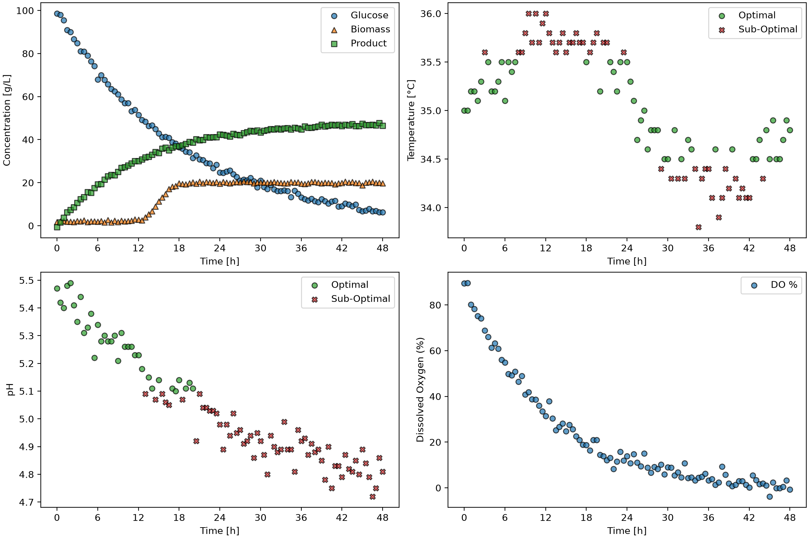

# Bioprocess Monitoring Pipeline
This is an automated Python pipeline for monitoring and visualizing fermentation process conditions given a CSV dataset.

## Overview
The purpose of this project is to create a visualization and summary of fermentation batch processes. The pipeline evaluates critical operating conditions like pH and temperature from a set of batch processes against a set of acceptable operating limits. This data is then summarized into a table and visualized as scatter plots.

## Features
This project is driven by the class, `BioprocessMonitor`, which has the following features:
* **Batch Extraction:** Extracts from fermentation datasets to isolate conditions for a single batche.
* **Tolerance Masking:** Flags measurements that fall outside of defined acceptable temperature and pH operating limits.
* **Dashboard Generation:** Uses Matplotlib to generate and save 2x2 grid visualizations displaying concentration curves, flagged temperature limits, flagged pH limits, and dissolved oxygen over time. 
* **Summary Table Export:** Calculates the percentage of optimal conditions maintained during a run and extracts the final product yield, automatically generating a CSV.

## Technology Used
python = 3.14.7
numpy = 2.5.2
matplotlib = 3.11.0

## Code Design
Executing `main.py` calls the `BioprocessMonitor` class and runs the pipeline operation modes A and B, passing different optimal pH and temperature parameters for each.
For every batch identified in the dataset, the script calls the `export_dashboard()` method to generate subplots tracking performance over time, saving them to the `figures/` directory. It then calls the `export_summary()` method, which computes process operating condition percentages and final product concentrations, exporting the results to the `tables/` directory.

## Dashboard

* **Top-Left** :
Glucose, biomass, and product concentrations versus time.

* **Top-Right** :
Measures optimal and sub-optimal temperature versus time.

* **Bottom-Left** :
Measures optimal and sub-optimal pH versus time.

* **Bottom-Right** :
Dissolved oxygen % versus time.

## Summary Table
|batch_id|ph_optimal_percent|temperature_optimal_percent|C_product_g_L^-1|
|--------|------------------|---------------------------|----------------|
|1       |93.81             |97.94                      |46.5            |
|2       |96.69             |97.52                      |50.8            |
|3       |95.89             |93.15                      |44.6            |
|4       |100.0             |96.47                      |48.6            |
|5       |48.62             |99.08                      |24.7            |

This summary table is an example of the output from this pipeline. It depicts the amount of time each batch remained in the optimal pH and temperature constraints respectively. It also displays the resulting product concentration at the end of each batch.
